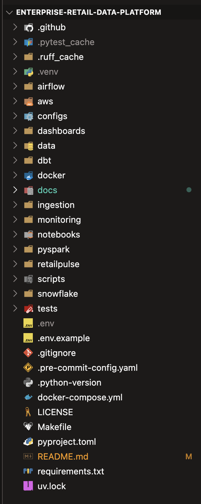
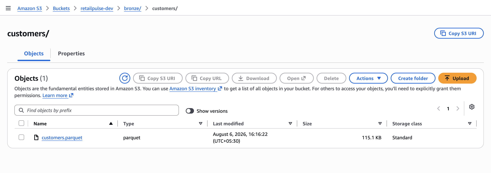
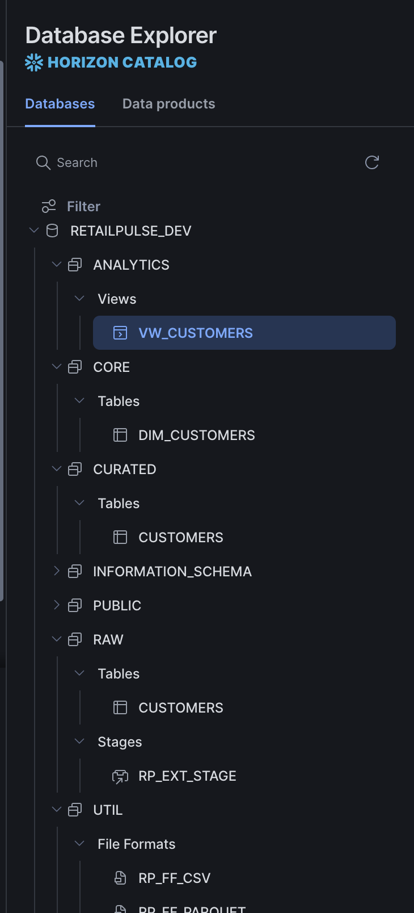
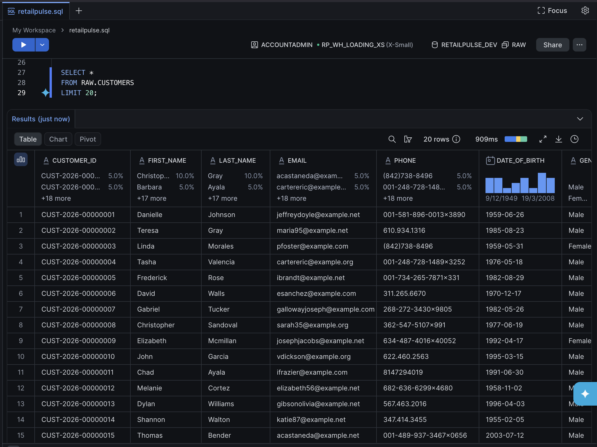
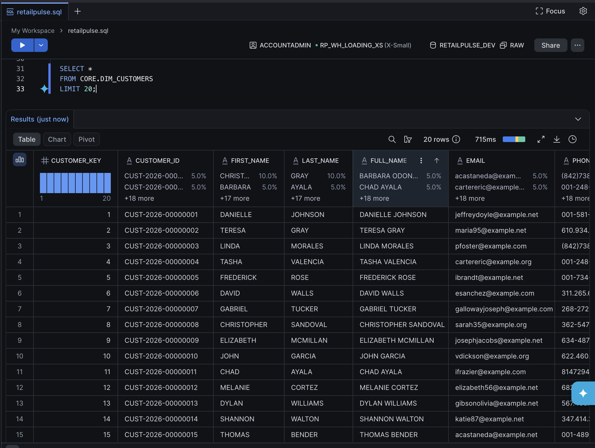
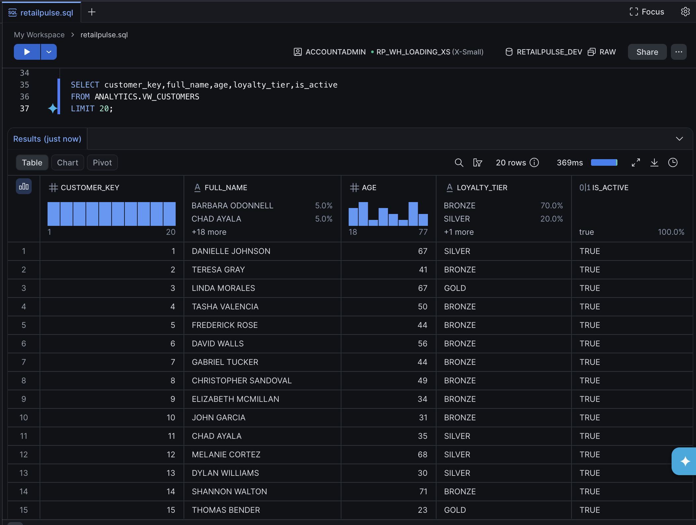

# RetailPulse Demo Guide

This guide demonstrates the complete RetailPulse customer data pipeline, from synthetic data generation to an analytics-ready Snowflake view.

---

# Demo Overview

RetailPulse follows an end-to-end cloud-native data pipeline.

```
Python Generator
      │
      ▼
customers.parquet
      │
      ▼
Amazon S3
      │
      ▼
Snowflake External Stage
      │
      ▼
RAW.CUSTOMERS
      │
      ▼
CURATED.CUSTOMERS
      │
      ▼
CORE.DIM_CUSTOMERS
      │
      ▼
ANALYTICS.VW_CUSTOMERS
```

---

# Step 1 — Project Structure

The project is organized into independent components for Python, AWS, Snowflake, testing, and documentation.



---

# Step 2 — Generate Customer Data

Generate 1,000 synthetic customer records.

```bash
uv run retailpulse generate customers \
    --count 1000 \
    --output-format parquet
```

Generated files:

```
data/
└── bronze/
    └── customers/
        ├── customers.csv
        └── customers.parquet
```

---

# Step 3 — Upload to Amazon S3

Upload the generated Parquet file.

```bash
aws s3 cp \
data/bronze/customers/customers.parquet \
s3://retailpulse-dev/bronze/customers/
```

Verify the upload.

```bash
aws s3 ls s3://retailpulse-dev/bronze/customers/
```

### Screenshot



---

# Step 4 — Snowflake Environment

RetailPulse uses separate schemas for each Medallion layer.

- RAW
- CURATED
- CORE
- ANALYTICS
- UTIL

### Screenshot



---

# Step 5 — RAW Layer

Execute:

```
snowflake/raw/
```

Scripts:

```
customers.sql

load_customers.sql

validate_customers.sql
```

Verify:

```sql
SELECT *
FROM RAW.CUSTOMERS
LIMIT 20;
```

### Screenshot



---

# Step 6 — CURATED Layer

Execute:

```
snowflake/curated/
```

Scripts:

```
customers.sql

validate_customers.sql
```

The CURATED layer:

- Standardizes customer data
- Normalizes names
- Cleans email addresses
- Removes unwanted whitespace

---

# Step 7 — CORE Layer

Execute:

```
snowflake/core/
```

Scripts:

```
dim_customers.sql

load_dim_customers.sql

validate_dim_customers.sql
```

Business transformations include:

- CUSTOMER_KEY
- FULL_NAME
- IS_ACTIVE

### Screenshot



---

# Step 8 — ANALYTICS Layer

Execute:

```
snowflake/analytics/
```

Scripts:

```
vw_customers.sql

validate_vw_customers.sql
```

Query:

```sql
SELECT *
FROM ANALYTICS.VW_CUSTOMERS
LIMIT 20;
```

### Screenshot



---

# Example Analytics Queries

## Customer Count

```sql
SELECT COUNT(*)
FROM ANALYTICS.VW_CUSTOMERS;
```

---

## Active Customers

```sql
SELECT *
FROM ANALYTICS.VW_CUSTOMERS
WHERE IS_ACTIVE = TRUE;
```

---

## Customer Distribution by Loyalty Tier

```sql
SELECT
    LOYALTY_TIER,
    COUNT(*) AS CUSTOMER_COUNT
FROM ANALYTICS.VW_CUSTOMERS
GROUP BY LOYALTY_TIER
ORDER BY CUSTOMER_COUNT DESC;
```

Expected distribution:

- Bronze
- Silver
- Gold
- Platinum

---

## Customers by State

```sql
SELECT
    STATE,
    COUNT(*) AS TOTAL_CUSTOMERS
FROM ANALYTICS.VW_CUSTOMERS
GROUP BY STATE
ORDER BY TOTAL_CUSTOMERS DESC;
```

---

# Customer Pipeline Summary

The Customer domain has been implemented end-to-end.

✅ Synthetic customer generation

✅ CSV & Parquet export

✅ Amazon S3 landing zone

✅ Snowflake Storage Integration

✅ External Stage

✅ RAW layer

✅ CURATED layer

✅ CORE dimensional model

✅ ANALYTICS reporting view

✅ Layer-level validation

---

# Next Steps

The next milestone is expanding RetailPulse with additional retail domains.

Planned domains include:

- Products
- Stores
- Orders
- Sales Fact Table
- dbt
- Apache Airflow
- Snowflake Streams & Tasks